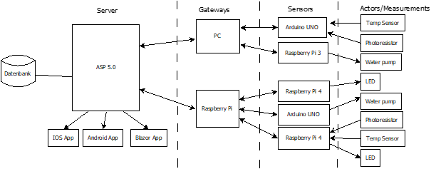
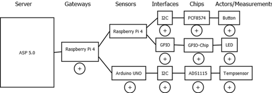
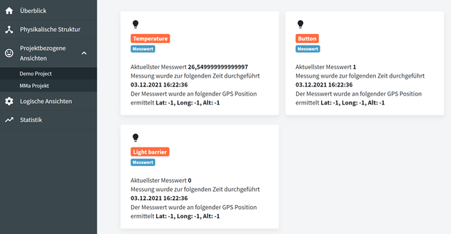

# Open³ Toolbox

Open³ Toolbox stands for Open Software, Open Hardware and Open Data. This toolbox therefore contains a collection of tools that offer the possibility of putting together the right IoT system without significant programming effort.
This is made possible by a modular structure.
Since the problems that can be solved using IoT systems are often similar, many solution approaches can be covered with just a few modules.
Not only are modules available for creating the systems, but also modules for visualizing the collected data.

## Architecture

## Simple View

## Visualisation Software

## Developer instructions
Detailed developer informations can be found [here](/Documentation/Entwicklerdokumentation.pdf)

## Supported by
The project was supported by [netidee](https://www.netidee.at).

Project progressions can be tracked at https://www.netidee.at/open3-toolbox
